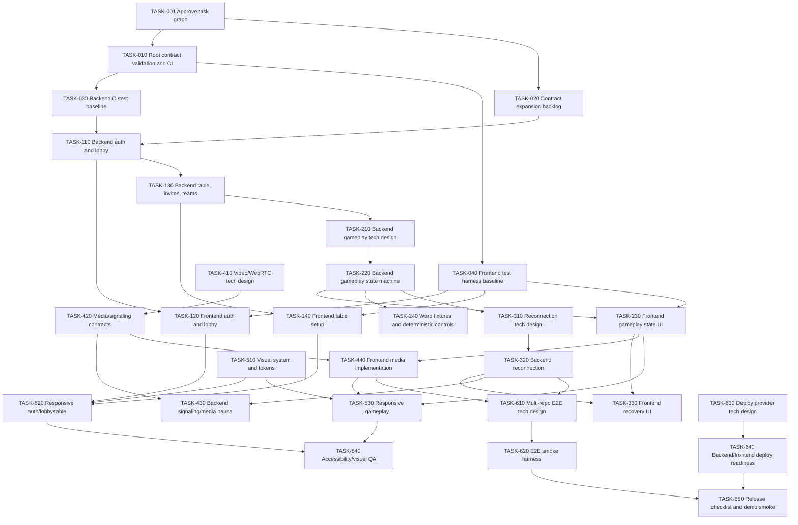

# TASK-GRAPH-001 - Mimico V1 Executable Task Graph

Status: Draft for Approval
Date: 2026-07-26

## Objective

Turn the accepted Phase 1 package into an executable implementation graph for Mimico V1 without implementing product code.

This graph defines execution waves, dependencies, task IDs, target repositories, classifications, source specs, contract dependencies, expected tests, verification commands, acceptance gates, branch/PR strategy, first recommended wave, known risks, and stop conditions.

No individual task files, test-first packs, or executable task entry instructions are created by this artifact.

## Source Documents Read

- `docs/PHASE-2-PLANNING-BRIEF.md`
- `docs/PHASE-1-CLOSEOUT.md`
- `docs/prd-v1.md`
- `docs/adr/ADR-001-ai-assisted-sdd-workflow.md`
- `harness/HARNESS-001-agent-execution.md`
- `specs/spec-map.md`
- `specs/GLOSSARY-001-glossary-and-invariants.md`
- `specs/DOMAIN-001-domain-model-state-machine.md`
- `contracts/CONTRACTS-001-executable-contracts.md`
- `contracts/openapi/mimico-v1.yaml`
- `contracts/asyncapi/mimico-realtime-v1.yaml`
- `contracts/schemas/error.schema.json`
- `contracts/schemas/team-assignment.schema.json`
- `contracts/schemas/match-state.schema.json`
- `contracts/schemas/realtime-event-envelope.schema.json`
- `specs/SPEC-001-auth-lobby.md`
- `specs/SPEC-002-table-teams.md`
- `specs/SPEC-003-match-gameplay.md`
- `specs/SPEC-004-video-chat.md`
- `specs/SPEC-005-reconnection-recovery.md`
- `specs/SPEC-006-mobile-desktop-experience.md`
- `specs/SPEC-007-deploy-observability.md`
- `docs/product-design/PRODUCT-DESIGN-001-visual-system-and-screen-layouts.md`
- `specs/TEST-STRATEGY-001-test-strategy.md`
- `docs/tech-design/TECH-DESIGN-001-contract-validation-and-ci.md`
- `api-mimico/pom.xml`
- `mimico-game/package.json`

## Execution Waves

### Wave 0 - Planning Gate

Goal: approve this graph before any task files are generated.

Tasks:

- `TASK-001`

Gate:

- User approves `TASK-GRAPH-001`.

### Wave 1 - Executable Foundation

Goal: make contracts and repo-local verification commands real before broad feature work.

Tasks:

- `TASK-010`
- `TASK-020`
- `TASK-030`
- `TASK-040`

Gate:

- Root contract validation exists.
- Backend and frontend baseline verification commands are known and runnable or explicitly documented as unavailable.
- First task files and test-first packs are approved before execution.

### Wave 2 - Auth, Lobby, Table Setup

Goal: implement the playable pre-match path with canonical auth, lobby, invites, table state, manual teams, and explicit match start.

Tasks:

- `TASK-110`
- `TASK-120`
- `TASK-130`
- `TASK-140`

Gate:

- Four authenticated users can reach a valid table setup path locally.
- Manual teams and explicit start produce canonical match setup state.
- Contracts and tests cover changed REST/WebSocket surfaces.

### Wave 3 - Core Gameplay Without Video Architecture

Goal: implement authoritative match gameplay state, initial turn selection, dice, word selection, guessing, special-tile steal, timeout, win, and rematch entry.

Tasks:

- `TASK-210`
- `TASK-220`
- `TASK-230`
- `TASK-240`

Gate:

- Server is authoritative for match state.
- Frontend no longer depends on mock gameplay state for the covered path.
- Gameplay events use canonical envelope and accepted names.

### Wave 4 - Reconnection And Recovery

Goal: implement fair pause/resume/forfeit behavior and refresh recovery.

Tasks:

- `TASK-310`
- `TASK-320`
- `TASK-330`

Gate:

- Active match disconnect pauses immediately.
- Timer freezes and resumes with preserved remaining time.
- Reconnection timeout awards win to the opponent team.
- Refresh restores server state.

### Wave 5 - Video, Media, And Chat Completion

Goal: decide and implement the video/WebRTC architecture and complete media-aware gameplay.

Tasks:

- `TASK-410`
- `TASK-420`
- `TASK-430`
- `TASK-440`

Gate:

- Dedicated video/WebRTC Tech Design is accepted.
- Media readiness and signaling contracts are accepted.
- Mime video and audio are functional enough for V1 gameplay.
- Mime media failure uses the accepted pause/recovery model.

### Wave 6 - Responsive UI, Visual Polish, And Accessibility

Goal: reach the accepted mobile/desktop and product-design quality bar across primary screens.

Tasks:

- `TASK-510`
- `TASK-520`
- `TASK-530`
- `TASK-540`

Gate:

- Required viewport smoke matrix passes or has explicit deferrals.
- Loading, empty, disabled, error, paused, reconnecting, final states are visible.
- Product-design references are satisfied for major screens.

### Wave 7 - E2E, Deploy, Observability, Release

Goal: prepare portfolio demo deployment, smoke checks, and release checklist.

Tasks:

- `TASK-610`
- `TASK-620`
- `TASK-630`
- `TASK-640`
- `TASK-650`

Gate:

- Deploy provider Tech Design is accepted.
- Backend and frontend deploy configuration is reproducible.
- Public demo passes post-deploy smoke.
- Release checklist is accepted.

## Dependency Graph

## Task Index

| Task ID | Title | Target Repo | Classification | Required Specs | Contract / Schema Dependencies | Product Design References | Required Tests / Future Pack | Expected Verification Commands |
| --- | --- | --- | --- | --- | --- | --- | --- | --- |
| `TASK-001` | Approve executable task graph | root `mimico` | `serial` | all accepted Phase 1 artifacts | all accepted contracts read, no contract edits | n/a | n/a | Markdown review only |
| `TASK-010` | Root contract validation and CI | root `mimico` | `serial` | `SPEC-007`, `TEST-STRATEGY-001`, `TECH-DESIGN-001` | OpenAPI, AsyncAPI, all JSON Schemas, samples | n/a | `TEST-FIRST-010` | `npm ci`; `npm run contracts:validate`; `npm run ci` |
| `TASK-020` | Contract expansion backlog for table chat, pause/reconnect, gameplay gaps | root `mimico` | `serial` | `SPEC-002`, `SPEC-003`, `SPEC-004`, `SPEC-005` | OpenAPI, AsyncAPI, `error`, `team-assignment`, `match-state`, event envelope schemas | n/a | `TEST-FIRST-020` | `npm run contracts:validate` |
| `TASK-030` | Backend CI and test-profile baseline | backend `api-mimico` | `parallel-safe` after `TASK-010` | `SPEC-007`, `TEST-STRATEGY-001` | root contract validation command documented as upstream gate | n/a | `TEST-FIRST-030` | `./mvnw test`; future CI workflow command |
| `TASK-040` | Frontend test harness baseline | frontend `mimico-game` | `parallel-safe` after `TASK-010` | `SPEC-006`, `TEST-STRATEGY-001` | event envelope and frontend fixture expectations | `PRODUCT-DESIGN-001` for visual smoke targets | `TEST-FIRST-040` | `npm ci`; `npm run build`; future `npm test` |
| `TASK-110` | Backend auth, session, lobby presence, lobby chat | backend `api-mimico` | `serial` | `SPEC-001`, `SPEC-004`, `SPEC-007` | OpenAPI auth/lobby paths, AsyncAPI lobby commands/events, `error`, event envelope | n/a | `TEST-FIRST-110` | `./mvnw test`; backend CI |
| `TASK-120` | Frontend auth and lobby integration | frontend `mimico-game` | `parallel-safe` after backend contracts pass | `SPEC-001`, `SPEC-004`, `SPEC-006` | OpenAPI auth/lobby paths, AsyncAPI lobby events, `error`, event envelope | `PRODUCT-DESIGN-001` Home/Auth/Lobby | `TEST-FIRST-120` | `npm run build`; future component/store tests |
| `TASK-130` | Backend table, invites, manual teams, explicit start | backend `api-mimico` | `serial` | `SPEC-002`, `SPEC-004`, `SPEC-007` | `POST /api/tables`, `GET /api/tables/{tableId}`, `POST /api/matches/start`, table WebSocket events, `team-assignment`, `error` | n/a | `TEST-FIRST-130` | `./mvnw test`; backend CI; `npm run contracts:validate` from root if contracts change |
| `TASK-140` | Frontend table setup and team assignment | frontend `mimico-game` | `parallel-safe` after `TASK-130` | `SPEC-002`, `SPEC-004`, `SPEC-006` | table REST/WS contracts, `team-assignment`, event envelope | `PRODUCT-DESIGN-001` Table Setup | `TEST-FIRST-140` | `npm run build`; future component/store tests; viewport smoke |
| `TASK-210` | Backend gameplay persistence/state Tech Design | root `mimico` | `requires-tech-design` | `SPEC-003`, `SPEC-005`, `TEST-STRATEGY-001` | `match-state`, gameplay AsyncAPI events | n/a | design review, no implementation pack until accepted | Markdown review; later `npm run contracts:validate` if contracts change |
| `TASK-220` | Backend gameplay state machine and commands | backend `api-mimico` | `serial` | `SPEC-003`, accepted `TASK-210` Tech Design | gameplay AsyncAPI commands/events, `match-state`, `error`, event envelope | n/a | `TEST-FIRST-220` | `./mvnw test`; backend CI; contract validation if schemas changed |
| `TASK-230` | Frontend authoritative gameplay UI and state client | frontend `mimico-game` | `serial` | `SPEC-003`, `SPEC-004`, `SPEC-006` | gameplay AsyncAPI events, `match-state`, event envelope | `PRODUCT-DESIGN-001` Match Dice/Word/Guessing/Final | `TEST-FIRST-230` | `npm run build`; future component/store tests; viewport smoke |
| `TASK-240` | Deterministic word, dice, timer fixtures for tests | backend `api-mimico`, possible root fixture docs | `serial` | `SPEC-003`, `TEST-STRATEGY-001` | word category values, match-state fixtures | n/a | `TEST-FIRST-240` | `./mvnw test`; root contract validation if samples added |
| `TASK-310` | Reconnection persistence/timer Tech Design | root `mimico` | `requires-tech-design` | `SPEC-005`, `SPEC-003`, `SPEC-007` | pause/reconnect event schemas, `match-state` pause fields | n/a | design review, no implementation pack until accepted | Markdown review; contract validation if contracts change |
| `TASK-320` | Backend reconnection, pause, resume, forfeit | backend `api-mimico` | `serial` | `SPEC-005`, accepted `TASK-310` Tech Design | `MATCH_PAUSED`, `PLAYER_RECONNECTED`, restored state/user queue, `match-state`, `error` | n/a | `TEST-FIRST-320` | `./mvnw test`; backend CI; contract validation if schemas changed |
| `TASK-330` | Frontend refresh recovery and paused/reconnecting UI | frontend `mimico-game` | `parallel-safe` after `TASK-320` | `SPEC-005`, `SPEC-006` | pause/reconnect/restored-state events, `match-state`, `error` | `PRODUCT-DESIGN-001` Paused/Reconnecting | `TEST-FIRST-330` | `npm run build`; future component/store tests; viewport smoke |
| `TASK-410` | Video/WebRTC architecture Tech Design | root `mimico` | `requires-tech-design` | `SPEC-004`, `SPEC-005`, `SPEC-006`, `SPEC-007` | signaling and media readiness contract needs | `PRODUCT-DESIGN-001` video direction | design review, no implementation pack until accepted | Markdown review |
| `TASK-420` | Media readiness and signaling contracts | root `mimico` | `serial` after `TASK-410` | `SPEC-004`, `SPEC-005` | AsyncAPI signaling/media events, event envelope, `error` | n/a | `TEST-FIRST-420` | `npm run contracts:validate` |
| `TASK-430` | Backend video signaling and media-failure pause integration | backend `api-mimico` | `serial` | `SPEC-004`, `SPEC-005`, accepted `TASK-410` | media/signaling AsyncAPI events, pause events, `error` | n/a | `TEST-FIRST-430` | `./mvnw test`; backend CI; contract validation if schemas changed |
| `TASK-440` | Frontend media permission, peer connection, video UI | frontend `mimico-game` | `serial` | `SPEC-004`, `SPEC-005`, `SPEC-006`, accepted `TASK-410` | media/signaling events, match-state pause fields | `PRODUCT-DESIGN-001` VideoTile, Match Guessing, Paused | `TEST-FIRST-440` | `npm run build`; future component/store/media tests; viewport smoke |
| `TASK-510` | Visual system tokens and core components | frontend `mimico-game` | `serial` | `SPEC-006` | n/a unless component state consumes errors/events | `PRODUCT-DESIGN-001` full visual system and component direction | `TEST-FIRST-510` | `npm run build`; visual/component smoke |
| `TASK-520` | Responsive auth, lobby, table screens | frontend `mimico-game` | `parallel-safe` after `TASK-510` | `SPEC-001`, `SPEC-002`, `SPEC-006` | auth/lobby/table contracts already implemented | `PRODUCT-DESIGN-001` Auth/Lobby/Table Setup | `TEST-FIRST-520` | `npm run build`; viewport smoke matrix |
| `TASK-530` | Responsive gameplay, paused, final, rematch screens | frontend `mimico-game` | `serial` | `SPEC-003`, `SPEC-004`, `SPEC-005`, `SPEC-006` | gameplay/reconnection/media contracts | `PRODUCT-DESIGN-001` Match/Paused/Final | `TEST-FIRST-530` | `npm run build`; viewport smoke matrix |
| `TASK-540` | Accessibility, motion, and visual QA pass | frontend `mimico-game` | `parallel-safe` after `TASK-520` and `TASK-530` | `SPEC-006`, `SPEC-004`, `SPEC-005` | n/a unless error state fixtures change | `PRODUCT-DESIGN-001` accessibility/motion/quality bar | `TEST-FIRST-540` | `npm run build`; future Playwright/accessibility smoke |
| `TASK-610` | Multi-repo E2E harness Tech Design | root `mimico` | `requires-tech-design` | `SPEC-007`, `TEST-STRATEGY-001`, all gameplay specs | root/backend/frontend contract consumption strategy | UI smoke requirements from `SPEC-006` | design review, no implementation pack until accepted | Markdown review |
| `TASK-620` | Multi-user E2E smoke harness | frontend `mimico-game`, optional root orchestration docs | `serial` after `TASK-610` | `SPEC-001` through `SPEC-007`, accepted `TASK-610` | all contract-sensitive flows | `PRODUCT-DESIGN-001` for viewport checks | `TEST-FIRST-620` | future Playwright command; backend/frontend startup commands |
| `TASK-630` | Deploy provider Tech Design | root `mimico` | `requires-tech-design` | `SPEC-007` | deployed contract validation and smoke strategy | n/a | design review, no implementation pack until accepted | Markdown review |
| `TASK-640` | Backend and frontend deploy readiness | backend `api-mimico`, frontend `mimico-game` | `serial` after `TASK-630` | `SPEC-007` | health endpoints, CORS/WS origins, smoke-relevant contracts | frontend production config states | `TEST-FIRST-640` | `./mvnw test`; `npm run build`; provider-specific checks |
| `TASK-650` | Release checklist, README, public demo smoke | root `mimico`, backend, frontend as needed | `serial` | `SPEC-007`, PRD readiness | contract drift checks | portfolio demo requirements | `TEST-FIRST-650` | `npm run contracts:validate`; backend CI; frontend build; post-deploy smoke checklist |

## First Recommended Execution Wave

After user approval of this graph, generate individual task files only for Wave 1:

- `TASK-010` - Root contract validation and CI
- `TASK-020` - Contract expansion backlog for table chat, pause/reconnect, gameplay gaps
- `TASK-030` - Backend CI and test-profile baseline
- `TASK-040` - Frontend test harness baseline

Recommended execution order inside Wave 1:

1. `TASK-010` first, because later agents need `npm run contracts:validate`.
2. `TASK-020` second, because auth/table/gameplay tasks need clarified contract gaps before implementation.
3. `TASK-030` and `TASK-040` may run in parallel after `TASK-010`, provided they do not edit root contracts.

## Acceptance Gates

- No production code starts before this graph, task files, test-first packs, and executable task entry instructions are separately approved.
- Any contract-sensitive implementation task must run the root contract validation command once `TASK-010` exists.
- Any task changing canonical contracts is `serial`.
- Any task touching backend and frontend behavior must define separate repo targets, verification commands, and commit/PR expectations.
- UI tasks are not ready unless they cite `PRODUCT-DESIGN-001` and `SPEC-006`.
- Tasks involving video/WebRTC, match state persistence, reconnection persistence/timer strategy, deploy provider selection, multi-repo E2E harness, or generated clients/types must not start implementation until their Tech Design is accepted.

## Suggested Branch And PR Strategy

- Root planning/contracts branch pattern: `feature/task-010-contract-validation`, `feature/task-020-contract-expansion`.
- Backend branch pattern from inside `api-mimico`: `feature/task-110-backend-auth-lobby`.
- Frontend branch pattern from inside `mimico-game`: `feature/task-120-frontend-auth-lobby`.
- Default integration flow is branch, commit, push, and open PR for Rodrigo's review; agents must not merge automatically.
- Cross-repo work must use separate branches and PRs per repo, with integration order documented in both PR descriptions.
- Contract changes should merge before backend/frontend consumers unless a coordinated PR stack explicitly says otherwise.
- First Wave PR order: root contract validation, root contract expansion, backend CI baseline, frontend test harness baseline.

## Known Risks

- Existing backend and frontend tests may encode legacy behavior; accepted specs and contracts are authority.
- AsyncAPI tooling may require implementation adjustment, but script names from `TECH-DESIGN-001` should remain stable.
- Table chat, pause/reconnect, restored state, media readiness, and video signaling contracts need expansion before implementation.
- Backend match state persistence and reconnection fairness are risky enough to require Tech Design.
- Frontend has no first-party test harness yet, so major UI work should wait for baseline test tooling.
- Video/WebRTC provider and signaling architecture are intentionally undecided.
- Multi-user E2E and deploy smoke are high value but should wait until repo-local flows exist.
- Production deploy provider is undecided and must not be smuggled into ordinary task text.

## Stop Conditions

Agents must stop before implementation when:

- a required behavior is not traceable to an accepted spec
- a required event, command, state, or payload is missing from canonical contracts
- an accepted spec conflicts with an executable contract
- a task would require generated clients/types before a Tech Design accepts that choice
- backend and frontend changes would need a shared contract that is still changing
- a database migration has data-loss risk
- video/WebRTC, reconnection persistence, deploy provider, or multi-repo E2E architecture is needed without an accepted Tech Design
- verification commands cannot be made explicit for the target repo
- a task would cross repo boundaries without separate commits and verification gates

## Approval Checkpoint

Stop here for user approval before generating individual `tasks/TASK-xxx.md` files.
